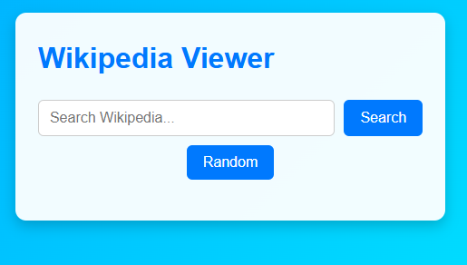

# 📚 Wikipedia Viewer

A simple and elegant **Wikipedia search app** built with **Vite + React**.  
Users can search Wikipedia articles, view results instantly, or open a random article — all in a clean, responsive interface.




---

## 🚀 Features

- 🔎 **Live Wikipedia Search** – Fetches search results from the Wikipedia API.  
- 🎲 **Random Article Button** – Opens a completely random Wikipedia page.  
- 📱 **Responsive Design** – Works seamlessly on mobile, tablet, and desktop.  
- ⚡ **Fast & Lightweight** – Powered by **Vite** and **React Hooks** (`useState`).  
- 🎨 **Modern UI** – Clean layout with hover effects and smooth transitions.  

---

## 🖥️ Demo

👉 **Live Demo:** [View on Vercel](#) 

---

## 📂 Project Structure
```bash
wiki
├── README.md
├── eslint.config.js
├── index.html
├── package-lock.json
├── package.json
├── public
│   ├── screenshot.png
│   ├── screenshot1.png
│   └── vite.svg
├── src
│   ├── App.jsx
│   ├── assets
│   │   └── react.svg
│   ├── index.css
│   └── main.jsx
└── vite.config.js
```


---

## ⚙️ Installation & Setup

Follow these steps to run the project locally:

```bash
# 1. Clone the repository
git clone https://github.com/<your-username>/wiki.git

# 2. Navigate to the project folder
cd wiki

# 3. Install dependencies
npm install

# 4. Start the development server
npm run dev
```
Open [http:/oca/llhost:5173](http:/oca/llhost:5173)
 to view it in your browser.

---
## 📖 How to Use

- Enter a keyword into the search bar (e.g., **React**, **NASA**).
- Click **Search** or press **Enter** to see related Wikipedia articles.
- Click on an article title to open it in a new tab.
- Or click **Random** to explore a random Wikipedia page.

---

## 🖌️ Responsive Design

✅ Mobile-friendly layout  
✅ Flexible search bar & buttons  
✅ Results displayed in clean, scrollable cards  

---

## 🛠️ Built With

- **[React](https://react.dev/)** – UI library  
- **[Vite](https://vitejs.dev/)** – Fast development build tool  
- **[Wikipedia API](https://www.mediawiki.org/wiki/API:Main_page)** – Data source  
- **CSS3** – Styling & responsiveness  

---

## 📈 Future Improvements

- 🔍 Add search suggestions as you type  
- 🌙 Dark mode toggle  
- ⭐ Save favorite articles locally  
- 🌎 Multi-language support  

---

## 🙏 Acknowledgments

- Thanks to **[freeCodeCamp](https://www.freecodecamp.org/)** for the original **Front End Libraries Project – Wikipedia Viewer Challenge** that inspired this app.  
- Inspired by the open web and the amazing **Wikipedia API** community.

---

## 📜 License

This project is open source and available under the **[MIT License](LICENSE)**. Feel free to use and modify

---

## 👤 Author

Made with ❤️ by **Landoh Clansy**
> Github [@Stabat47](github.com/Stabat47)
